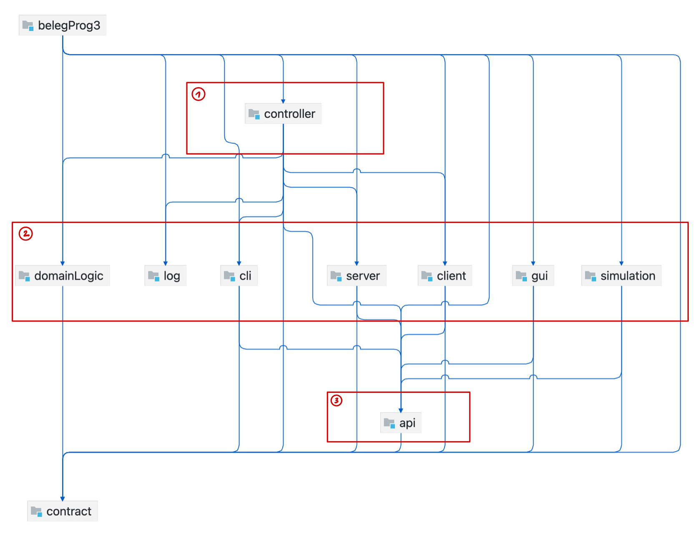

# Lagerverwaltungssystem

**HTW Berlin – Fachbereich 4: Informatik in Kultur und Gesundheit**  
**Modul:** Programmierung 3 
**Leitung:** Sebastian Lohmann  

---

## Übersicht

Dieses Projekt realisiert eine **mehrschichtige, eventbasierte Lagerverwaltungs-Anwendung** mit **vollständiger Testabdeckung, CLI- und GUI-Oberfläche, Simulationen und Netzwerkunterstützung (TCP/UDP)**.  
Die Anwendung wurde im Rahmen des Moduls *Programmierung 3* an der HTW Berlin entwickelt.

Die Architektur trennt strikt zwischen Test- und Produktivcode, verwendet **JUnit5** für Tests, **Mockito** als Mock/Spy-Framework und **JavaFX** für die GUI.  
Es wurden keine weiteren Bibliotheken genutzt.

---

## Projektziel

Ziel war die Entwicklung einer modularen, getesteten und skalierbaren Anwendung zur Verwaltung eines Lagers mit begrenzter Kapazität.  
Die Anwendung unterstützt Kund*innenverwaltung, Einlagerung, Inspektion, Persistenz (JOS / JBP) und Netzwerkkommunikation über TCP oder UDP.

---

## Funktionsumfang

### Geschäftslogik (GL)
- Verwaltung von Kund*innen, Frachtstücken und Gefahrenstoffen  
- Kapazitätsprüfung beim Einfügen von Frachtstücken  
- Vergabe von Einfügedatum und Lagerplatz  
- Thread-sichere Implementierung  
- Ausgabe aller Kund*innen mit Anzahl ihrer Frachtstücke  
- Filterung von Frachtstücken nach Typ  
- Anzeige vorhandener und nicht vorhandener Gefahrenstoffe  
- Löschen von Kund*innen und Entfernen von Frachtstücken  
- Setzen des letzten Inspektionsdatums  

### CLI
- Zustandsbasiertes Kommandozeilen-Interface mit Befehlen:
  - `:c` Einfügemodus  
  - `:d` Löschmodus  
  - `:r` Anzeigemodus  
  - `:u` Änderungsmodus  
  - `:p` Persistenzmodus  
- Basiert vollständig auf Events (Beobachtermuster)  
- Zwei Observer:
  - Warnung bei Überschreitung von 90 % Kapazität  
  - Benachrichtigung bei Änderungen an Gefahrenstoffen  

### Alternatives CLI
- Abgespeckte Variante mit nur einem Observer  
- Deaktivierte Funktionen: Löschen von Kund*innen, Auflisten von Gefahrenstoffen, Kapazitätsbeobachter  
- Unterscheidet sich ausschließlich durch die Konfiguration (Setup in `main`)  

### Simulationen
- **Simulation 1:** Einfügen und Löschen in parallelen Threads  
- **Simulation 2:** Erweiterung mit n Threads für beide Operationen  
- **Simulation 3:** Synchronisation via `wait/notify`, zusätzlicher Inspektions-Thread, periodische Zustandsausgabe über `ExecutorService`  

### GUI (JavaFX)
- Vollständiger Funktionsumfang des CLI (ohne Observer)  
- Dynamische Tabellenansichten für Kund*innen und Frachtstücke  
- Sortierung nach Platz, Kund*in, Inspektionsdatum, Einlagerungsdauer  
- Drag-and-Drop zum Tauschen von Lagerplätzen  
- Nebenläufiges Einfügen von Frachtstücken  
- Datenbindung für automatische Aktualisierung  

### I/O
- Persistenz über **JOS** und **JBP** (Speichern und Laden)  
- In CLI und GUI integriert  

### Netzwerk (TCP/UDP)
- Verwendung von Geschäftslogik und CLI in getrennten Prozessen  
- Server mit mehreren konkurrierenden Clients für beide Protokolle  
- Skalierbarkeit und Transaktionskontrolle nicht erforderlich  

### Logging
- Optionales, mehrsprachiges Logsystem (`log.txt`)  
- Sprachumschaltung per Kommandozeilenparameter `EN` / `DE`  
- Logeinträge für alle Benutzeraktionen und Änderungen an der GL  
- Geschützter Zugriff auf die Logdatei  
- Erweiterbar für zusätzliche Sprachen  

---

## Architektur

**Schichtenarchitektur mit sechs Modulen:**
1. **belegProg3** – Einstiegspunkt, `main`-Methoden  
2. **contract** – Interfaces und Datentypen  
3. **domainLogic** – Geschäftslogik (CustomerManagement, CargoStorage)  
4. **eventSystem** – Event- und Listener-Struktur  
5. **presentation** – CLI und GUI  
6. **net** – Netzwerk-Funktionalität (TCP/UDP-Client / Server)  

**Architekturprinzipien:**
- Strikte Trennung zwischen Präsentation, Logik und Daten  
- Event-basierte Kommunikation  
- Kontrollschicht vermittelt zwischen den Modulen  
- Vollständig testbare und kapselte Geschäftslogik  

---

## Tests

- **Testframework:** JUnit 5  
- **Mocking:** Mockito  
- **Testabdeckung:** 92 % (line coverage)  
- **Testabdeckung Geschäftslogik:** 100 %  
- **Mindestens 5 Mockito-Tests** und **4 Spy-Tests**  
- Alle Tests deterministisch, betriebssystemunabhängig und schnell  
- Kein Zugriff auf Dateisystem oder Netzwerk in Tests  

---

## Quellen

- StackOverflow – Serialisierung/Deserialisierung von Objekten über UDP  
  <https://stackoverflow.com/questions/4252294/sending-objects-across-network-using-udp-in-java>  
- YouTube: *JavaFX Background Tasks | How to make your GUI smoother, faster and snappier*  
- StackOverflow – Drag & Drop in JavaFX TableView  
  <https://stackoverflow.com/questions/28603224/sort-tableview-with-drag-and-drop-rows>  
- Bileam Tschepe (2021): *Playing Drums With Kinect – TouchDesigner + Kinect Tutorial 3*  
- Nielsen, J. (2020): *10 Usability Heuristics for User Interface Design*  
- Wigdor & Wixon (2011): *Brave NUI World*  

